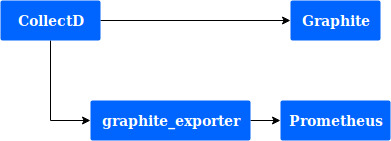

# Prometheus

## Problem statement
Our current alert solution isn't capable of more advanced configurations that could help understand the root cause of issues.
Configurations that Cabot, our current alert solution, handles:
* Graphite checks
  * metric based alerts
  * number of fails before alert  
* Http checks
  * almost never used
  * used to check if an application is answering requests
* Instances
  * manually link an alert to an instance
* Jenkins checks
  * never used
* Reports
  * brings everything Cabot has access to
* Recovery instructions
  * scripts that could be ran to solve things automatically

Using it, we undesrtood that its not enough for our case. During the 2019 year, at first half of the year, we had some issues with our current metric solution.
There were times when Graphite was returning 503's and no metrics could be gathered, so, triggering alerts.

It was frustrating when people were in their resting time and received an alert because HG wasn't sending metrics instead of being alarmed by an application malfunction.

## Solution statement
Prometheus does everything that Cabot does, plus:
* Grouping alerts
  * grouping categorizes alerts of similar nature into a single notification, which is useful during larger outages when many systems fail at once and hundreds of alerts may be firing simultaneously
* Inhibition
  * supress notifications for certain alerts if certain other alerts are already firing
  * could be used when HG isn't accessible
* Automation
  * brings the possibility to have alerts enabled by default
* Integration with Kubernetes
* Integration with AWS

## Considerations
* The transition should be invisible to the final user.
* Instead of using and adapter to make Prometheus write/read from Graphite, the goal is to use [graphite_exporter](https://github.com/prometheus/graphite_exporter) and [statsd_exporter](https://github.com/prometheus/statsd_exporter) to export metrics into Prometheus
* As this is just a PoC, I'll **not** configure Alertmanager and other softwares, just going to show some CollectD metrics using Prometheus.

## Plugins that I think is interesting:
### Grafana
* https://grafana.com/plugins/camptocamp-prometheus-alertmanager-datasource

## Alternatives considered
[Sensu](https://sensu.io/)

## How to run:
* install docker-compose
* clone this repository
```
$ git clone git@github.com:bred86/prometheus_poc.git
```
* run everything
```
$ cd prometheus_poc
$ docker-compose up
```
* access it via `localhost:9090`

It'll start everything needed:
* Graphite
* graphite_exporter
* CollectD
* Prometheus

The infrastructure looks like this:

